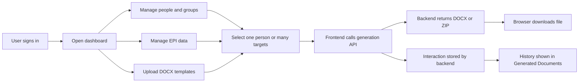
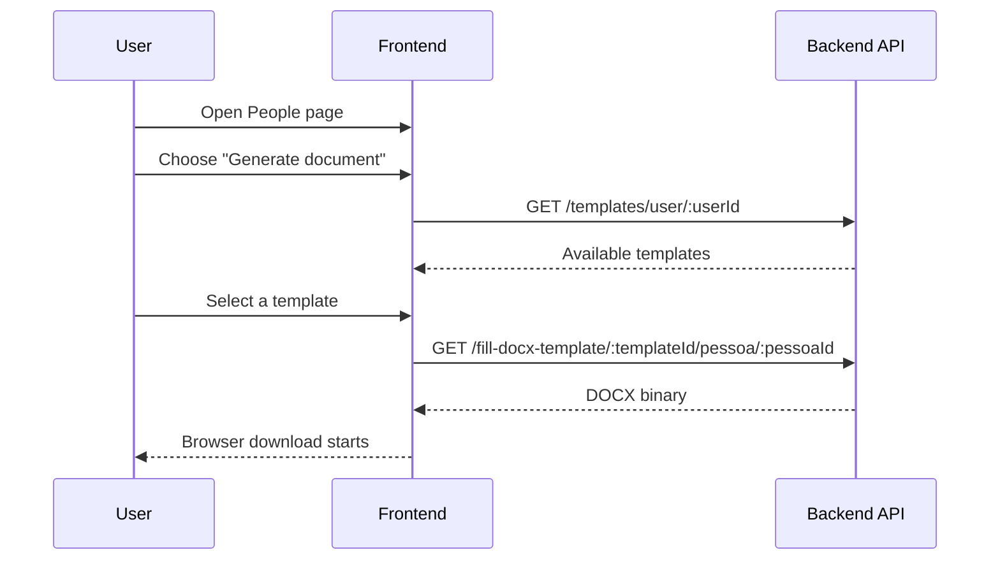
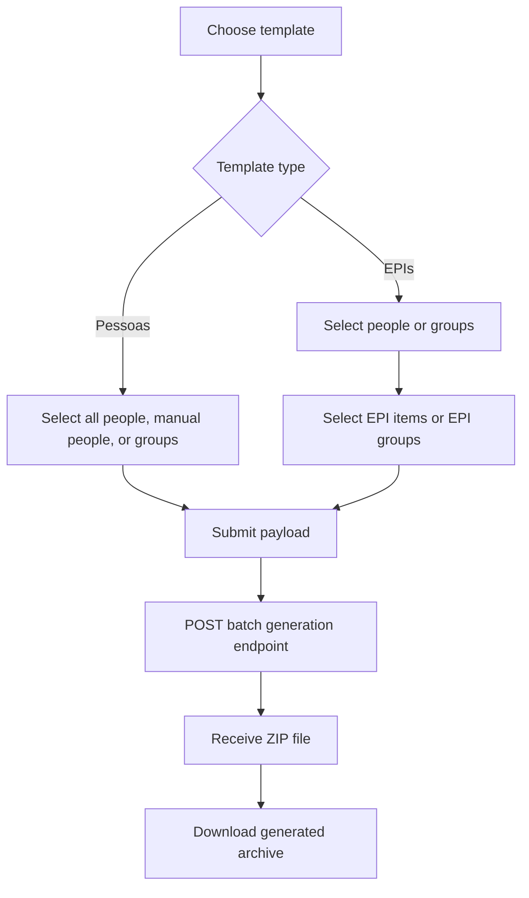
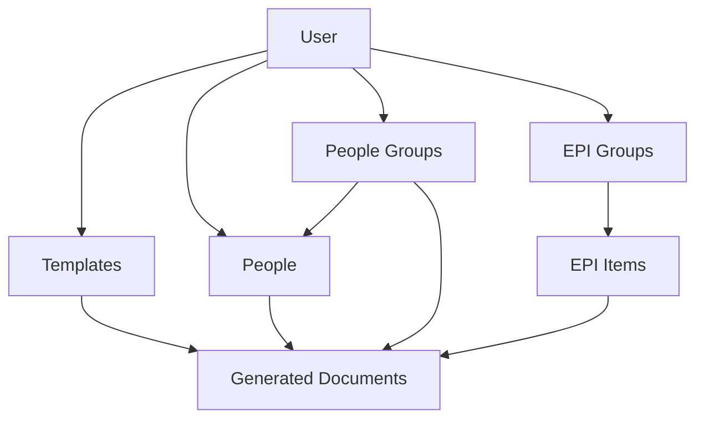

# Doc Filler Frontend

Doc Filler Frontend is a React application for managing people, document templates, EPI records, and bulk document generation workflows. It is the frontend for the backend project [`doc-filler-api-js`](https://github.com/teixeira308/doc-filler-api-js), allowing authenticated users to upload `.docx` templates, maintain structured data, and download generated documents or ZIP bundles produced by the API.

The project is built with Create React App, React Router, Styled Components, and native `fetch` calls for API integration.

## What the app does

The application is organized around a document automation workflow:

- Authenticate users and persist the session in `localStorage`
- Manage people records with detailed personal, contact, training, and compliance fields
- Organize people into groups for faster bulk operations
- Manage EPI groups and individual EPI items
- Upload and maintain Word templates (`.docx`)
- Generate filled documents for one person or in batches
- Track generated document interactions in a dedicated history screen
- Import people, EPI groups, and EPI items from Excel files

## Main modules

### Authentication

- Login is handled against `POST /users/login`
- The frontend stores `email`, `token`, and `userId` in `localStorage`
- Protected routes are rendered only when a valid session exists

### People

- Paginated people listing
- Search by name, CPF, or group
- Create, edit, inspect, and delete a record
- Bulk delete support
- Excel import support
- Single-document generation from a selected template

### People Groups

- Create, edit, delete, search, and paginate groups
- Used as a selection layer for batch document generation

### Templates

- Upload template files with metadata
- Supported template categories:
  - `Pessoas`
  - `EPIs`
- Download the original uploaded template
- Update and delete templates
- Launch batch generation flows

### EPI and EPI Groups

- Manage EPI groups
- Manage individual EPI items
- Import both from Excel
- Use EPI data during specialized batch generation flows

### Generated Documents

- Displays generation history returned by `/interactions`
- Shows template type, related people, groups, EPIs, and timestamp

## Tech stack

- React 18
- React Router DOM 6
- Styled Components
- React Icons
- Native `fetch` for API requests
- Create React App

## Project structure

```text
src/
  components/   reusable UI and modal flows
  contexts/     authentication context
  hooks/        auth and route helpers
  pages/        route-level screens
  services/     API access hooks
  styles/       global styling
```

## Routing overview

Protected application areas:

- `/home`
- `/pessoas`
- `/grupo`
- `/epi`
- `/grupo-epi`
- `/templates`
- `/documentos`
- `/demonstracao`
- `/suporte`
- `/tutorial`

Additional routes:

- `/` login screen
- `/signup`
- `/pessoas/novo`
- `/pessoas/editar/:idPessoa`
- `/pessoas/detalhes/:idPessoa`
- `/template/gerar`
- `/template/gerar/:idTemplate`

The router is configured with `basename="/docfiller"`, and `package.json` also sets `homepage` to `/docfiller`. This is important when deploying under a subpath instead of the domain root.

## Environment variables

Create a `.env` file in the project root and define:

```bash
REACT_APP_DOCFILLER_API=http://localhost:3001
```

This value is used as the base URL for all backend requests.

## Getting started

### Prerequisites

- Node.js 18+ recommended
- npm or Yarn
- A running Doc Filler backend API

### Install dependencies

```bash
npm install
```

or

```bash
yarn
```

### Start the development server

```bash
npm start
```

or

```bash
yarn start
```

The app will be available at:

```text
http://localhost:3000/docfiller
```

### Production build

```bash
npm run build
```

or

```bash
yarn build
```

## API integration summary

The frontend consumes endpoints grouped by business area:

- Auth: `/users/login`
- People: `/pessoas`, `/pessoas/import`, `/pessoas/delete-all`
- People groups: `/grupo`
- Templates: `/templates`, `/templates/user/:userId`, template download endpoints
- Document generation:
  - `/fill-docx-template/:templateId/pessoa/:pessoaId`
  - `/fill-docx-template/batch`
  - `/fill-docx-template/batch/epi`
- EPI: `/epi`, `/epi/import`, `/epi/grupo/:grupoId`
- EPI groups: `/grupo-epi`, `/grupo-epi/import`
- Interactions: `/interactions`

## Core workflow



## Single document generation



## Batch generation flow



## Data model at a glance



## Notes for deployment

- The app expects to run under `/docfiller`
- Client-side routing should be configured so all application routes resolve to `index.html`
- The backend must allow authenticated CORS requests from the frontend origin

## Current implementation characteristics

- Session persistence is handled in the browser with `localStorage`
- API requests are implemented with service hooks in `src/services`
- Styling is based on `styled-components`
- The UI heavily relies on modal-based CRUD flows and route-based detail/edit pages

## Available scripts

- `npm start` or `yarn start`: run in development mode
- `npm run build` or `yarn build`: create a production build
- `npm test` or `yarn test`: run tests
- `npm run eject` or `yarn eject`: eject Create React App configuration
